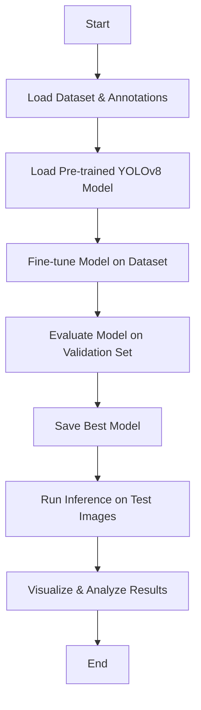

# Task 1: Car Detection in Indonesia using YOLOv8

## Overview
This project demonstrates how to use transfer learning with a pre-trained YOLOv8 model to detect cars in images from the [Kaggle road-vehicle-images-dataset](https://www.kaggle.com/datasets). The workflow includes data preparation, model fine-tuning, evaluation, and inference.

---

## Project Structure

- `car-detection-indonesia.ipynb` — Main Jupyter notebook for training and inference
- `requirements.txt` — List of required Python packages
- `runs/` — Directory for YOLOv8 training outputs (created after training)
- `README.md` — Project documentation

---

## How the Application Runs

```mermaid
flowchart TD
    A[Start Application] --> B[Load Trained YOLOv8 Model]
    B --> C[Input Image(s)]
    C --> D[Run Inference]
    D --> E[Detect Cars in Image]
    E --> F[Display/Save Results]
    F --> G[End]
```

---

## Training & Inference Pipeline



---

## How to Run

1. **Install Requirements**
    ```bash
    pip install -r requirements.txt
    ```
    Or, run the first cell in the notebook to install `ultralytics`.

2. **Download Dataset**
    - Download the [road-vehicle-images-dataset](https://www.kaggle.com/datasets) from Kaggle.
    - Update the `dataset_yaml` path in the notebook if needed.

3. **Run the Notebook**
    - Open `car-detection-indonesia.ipynb` in Jupyter or VS Code.
    - Execute each cell in order.

---

## Results

- The notebook will output training logs, evaluation metrics, and sample inference results.
- Training logs and best model weights are saved in the `runs/detect/road_vehicle_transfer` directory.

---

## Notes

- Adjust hyperparameters (epochs, batch size, etc.) as needed for your hardware.
- For more details, see the [Ultralytics YOLOv8 documentation](https://docs.ultralytics.com/).

---

## License

This project is for educational purposes.